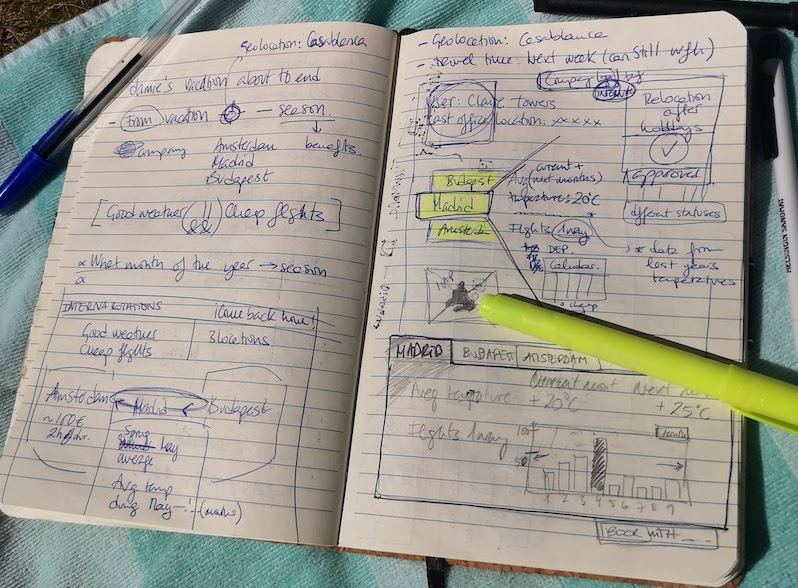
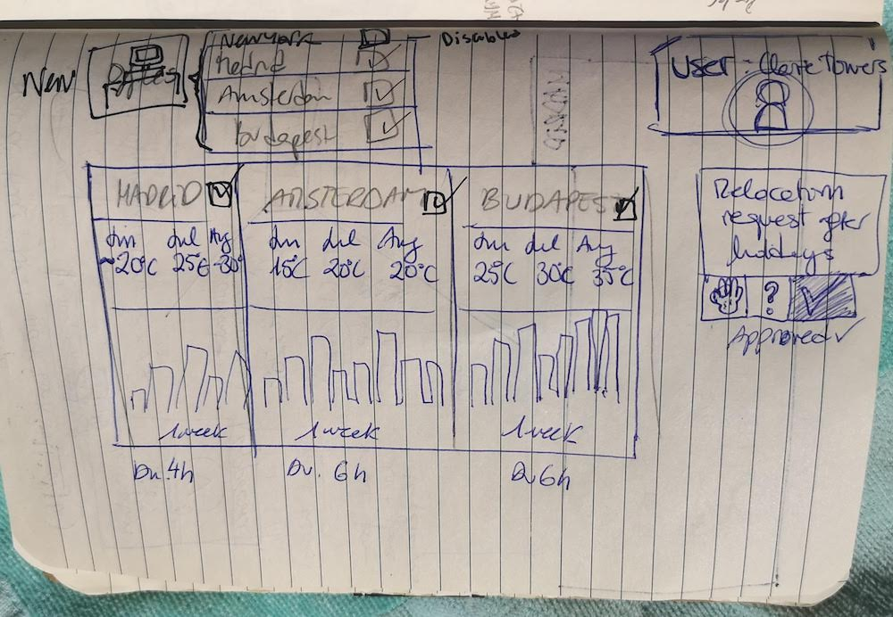
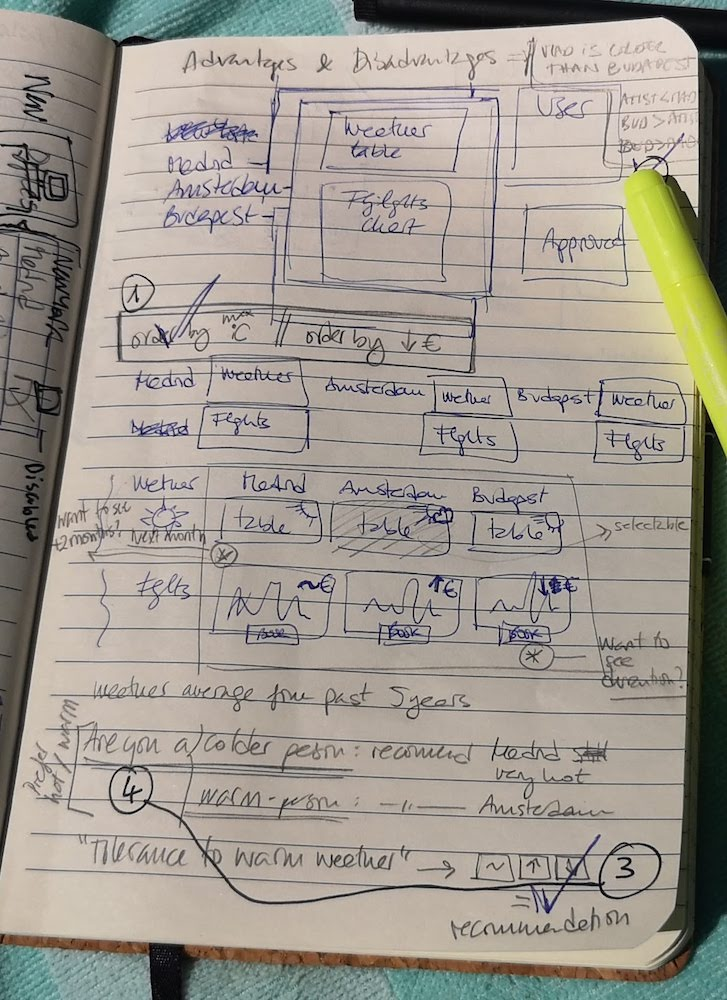
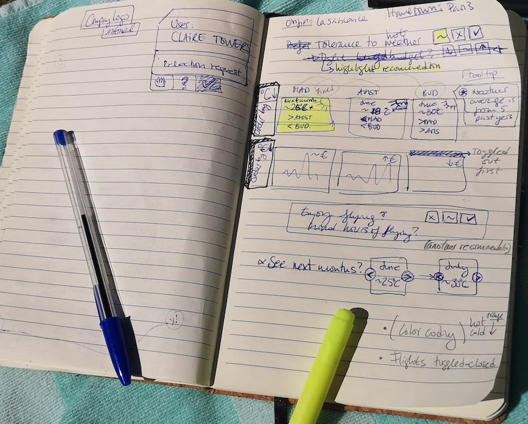
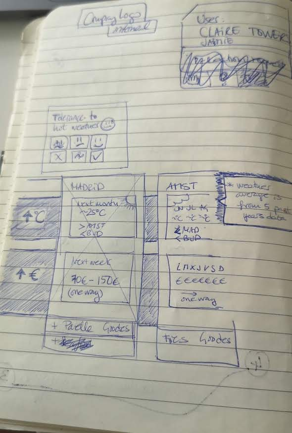

This project was bootstrapped with [Create React App](https://github.com/facebook/create-react-app).

## The how

### Analyzing problem

### Thinking of presentation of comparison

### Highlighting key parts

### Something similar to what it came out to be

### Ready for starting

> I also simplified some things, to have time to deliver something decent.
